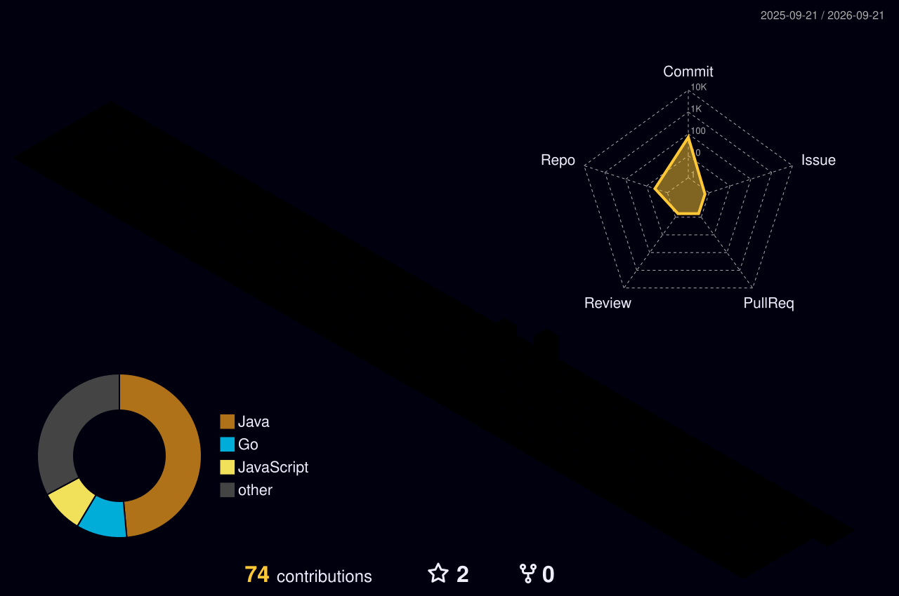

<div align="center">



<br />

<em>Building useful systems where software meets infrastructure.</em>

<br /><br />

<code>backend</code> · <code>infrastructure</code> · <code>automation</code> · <code>internal tools</code>

</div>


<table>
<tr>
<td width="58%" valign="top">

### `$ cat profile.md`

I build practical software for real-world operations. My work spans backend development, infrastructure, automation, and internal tools—with a focus on making complex systems easier to use and maintain.

I enjoy turning complicated workflows into clear interfaces and dependable systems. The best tools, to me, are the ones people can understand, trust, and keep improving.

</td>
<td width="42%" valign="top">

### `$ cat toolkit.txt`

```text
languages   Go · Python · TypeScript
data        PostgreSQL · Redis
systems     Linux · Docker · nginx
web         Vue · SvelteKit · Django
mobile      Kotlin · Compose
```

</td>
</tr>
</table>


### `$ ls selected-work/`

<table>
<tr>
<td width="33%" valign="top">

#### `01` Network Monitor

An operations platform for network visibility, automation, alerts, and historical insight.

<sub>Go · Vue · PostgreSQL</sub>

</td>
<td width="33%" valign="top">

#### `02` Fiber Core Mapping

Geospatial infrastructure inventory and field reporting for fiber networks.

<sub>Django · SvelteKit · MapLibre</sub>

</td>
<td width="34%" valign="top">

#### `03` Network Toolkit

A focused Android toolbox for practical field diagnostics and everyday utilities.

<sub>Kotlin · Jetpack Compose</sub>

</td>
</tr>
</table>

<details>
<summary><strong>Public experiments</strong> · smaller tools and early projects</summary>

- [**port-scanner**](https://github.com/MMahesa/port-scanner) — a concurrent TCP port scanner written in Go.
- [**tools-registrasi**](https://github.com/MMahesa/tools-registrasi) — a small JavaScript registration utility.
- [**discord-lyrics**](https://github.com/MMahesa/discord-lyrics) — a Discord bot experiment built around a public API.

</details>


### `$ activity --year`

<div align="center">
  
</div>

<details>
<summary><strong>More activity</strong> · contribution trail and repository metrics</summary>

<br />

<div align="center">
  <picture>
    <source media="(prefers-color-scheme: dark)" srcset="https://raw.githubusercontent.com/MMahesa/MMahesa/output/pacman-contribution-graph-dark.svg">
    <source media="(prefers-color-scheme: light)" srcset="https://raw.githubusercontent.com/MMahesa/MMahesa/output/pacman-contribution-graph.svg">
    
  </picture>
</div>

<br />

<div align="center">
  
</div>

</details>


### `$ cat approach.txt`

> I like software that is useful, understandable, and easy to operate. Good engineering should reduce uncertainty—not add more of it.

<div align="center">
  
</div>

<br />

<div align="center">
  
</div>
